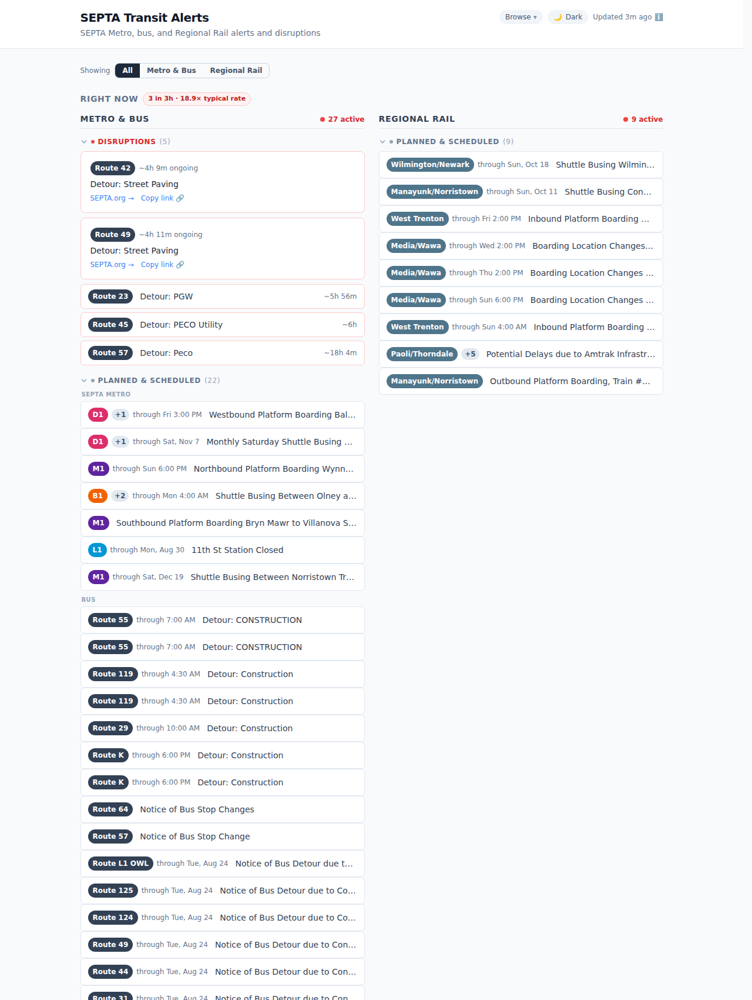
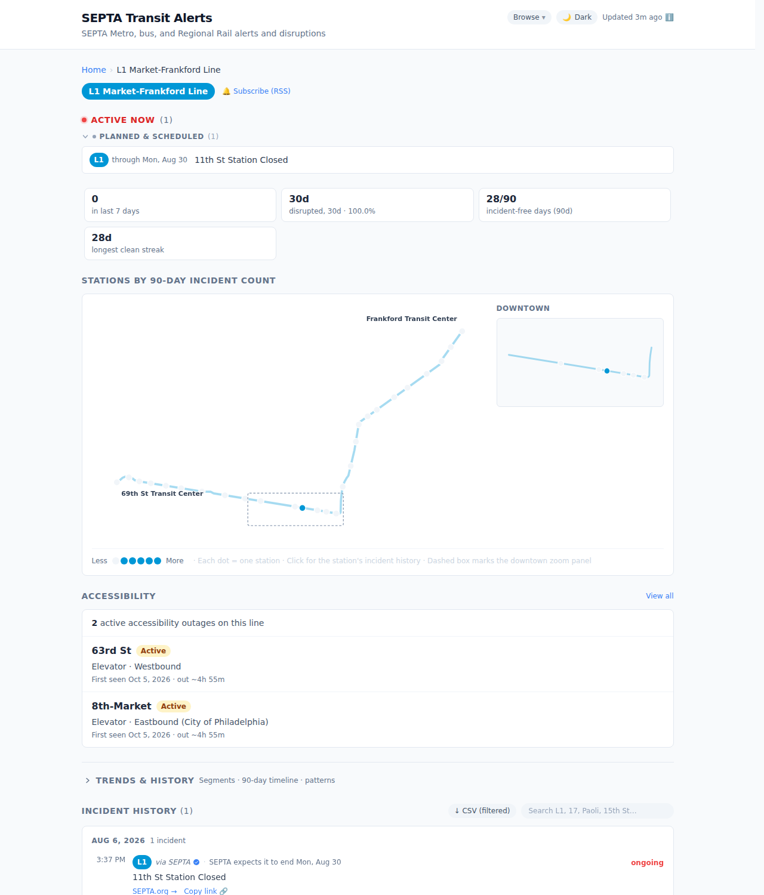
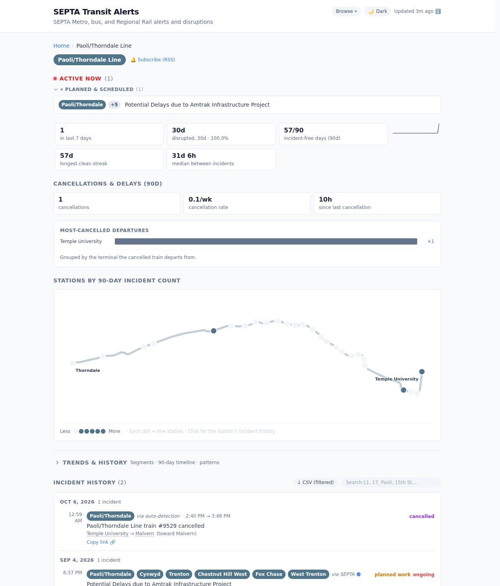
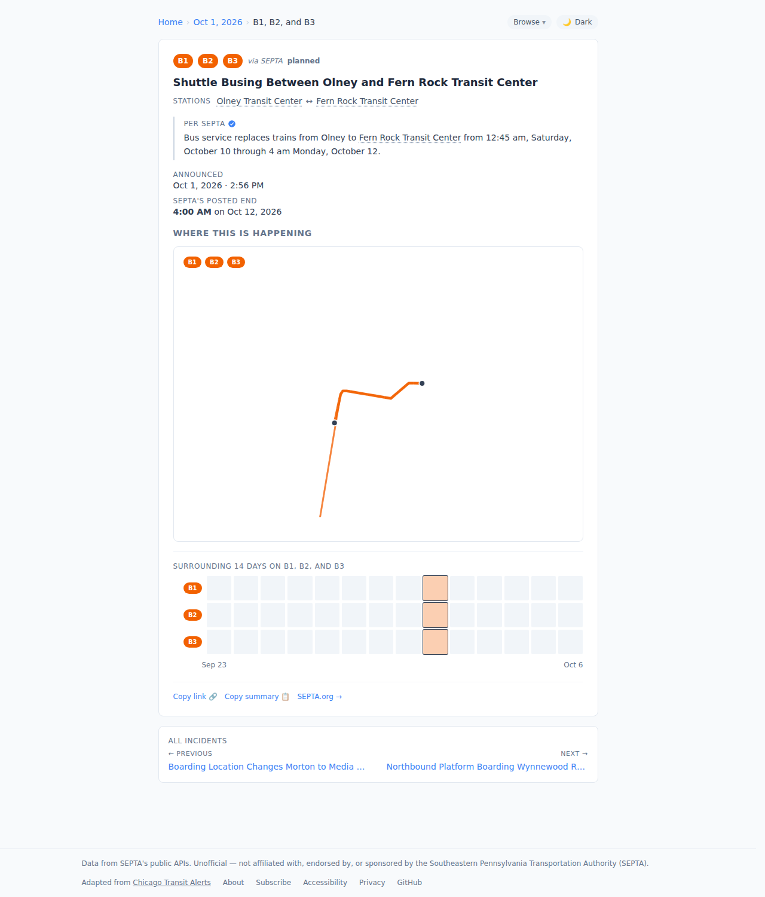
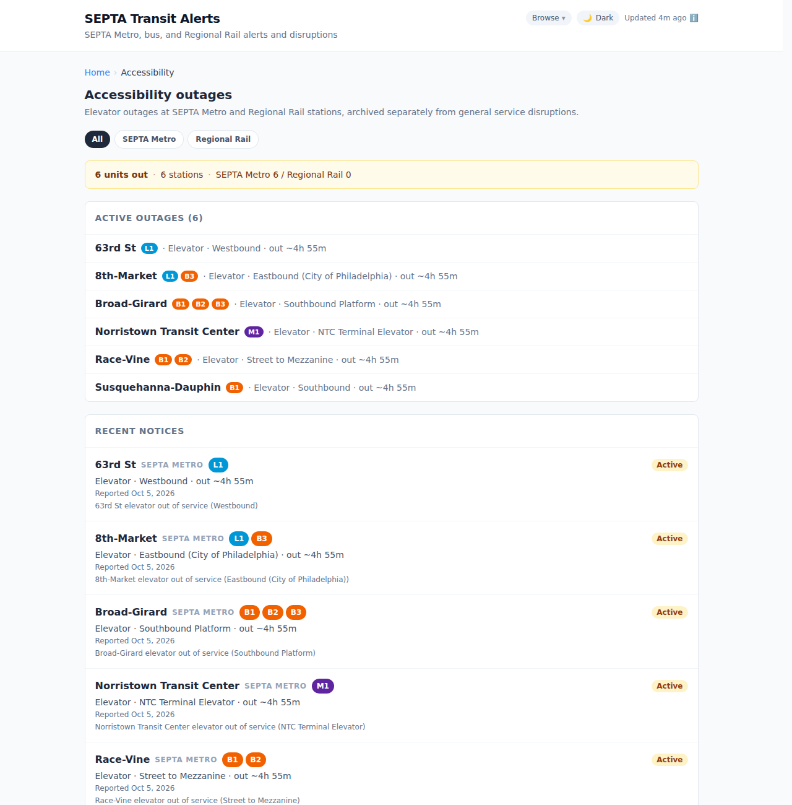
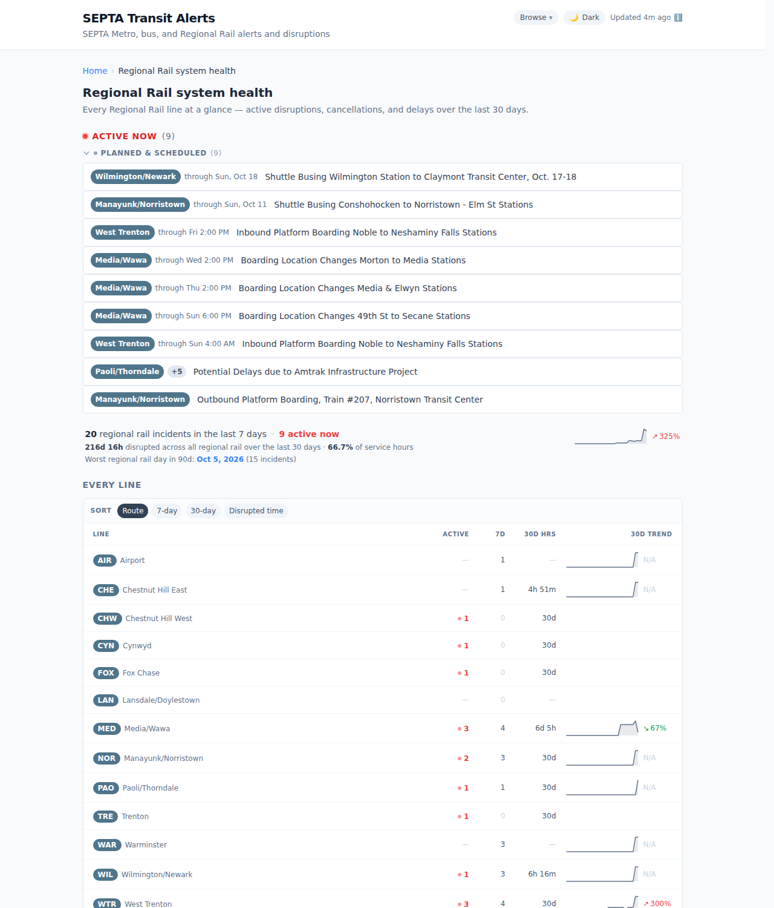
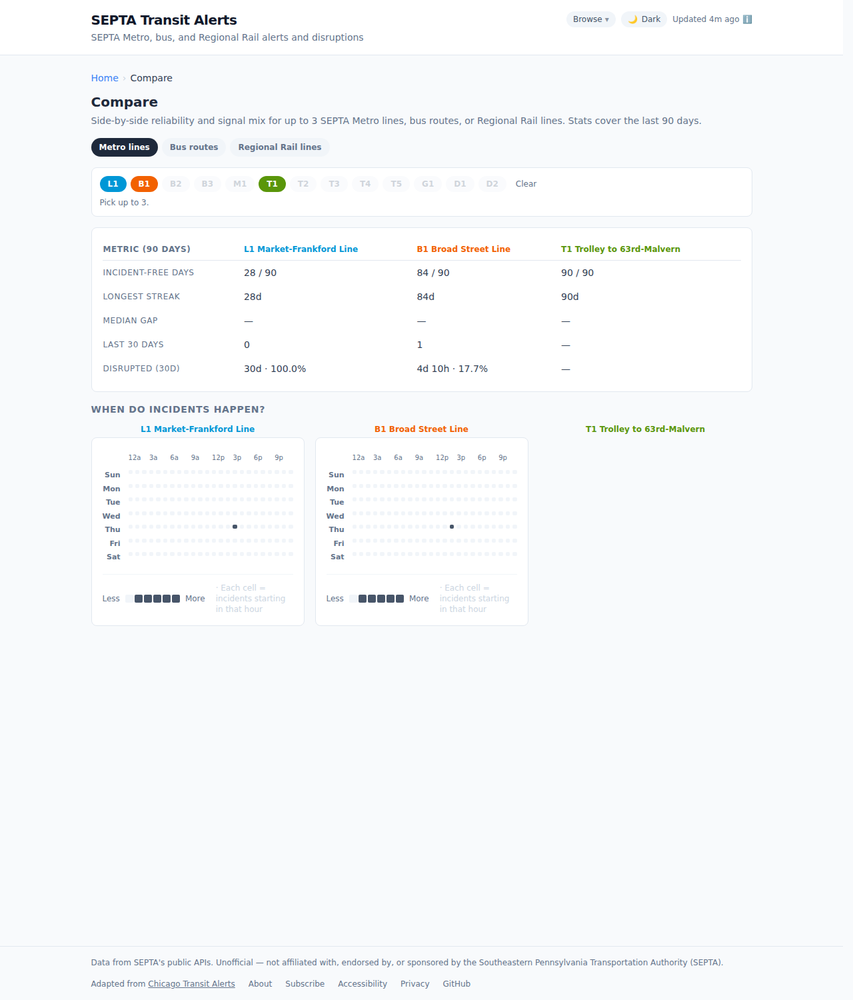
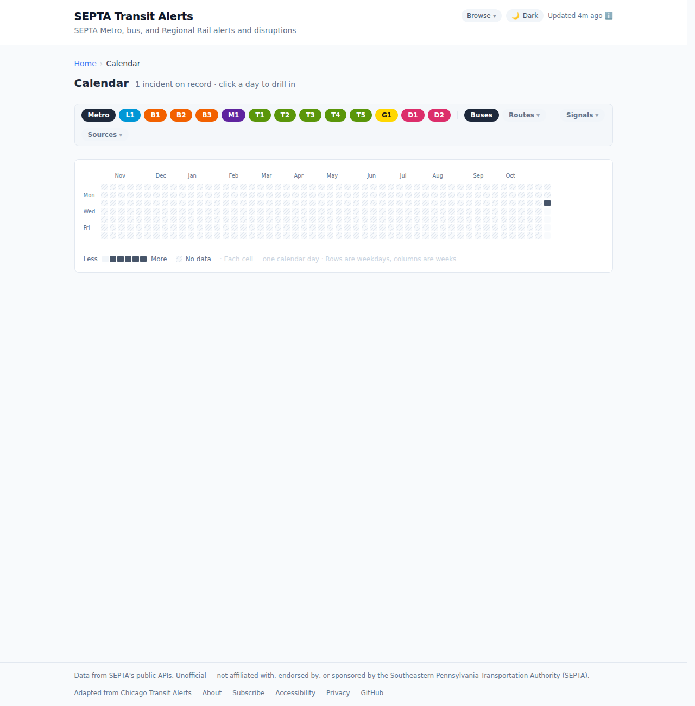
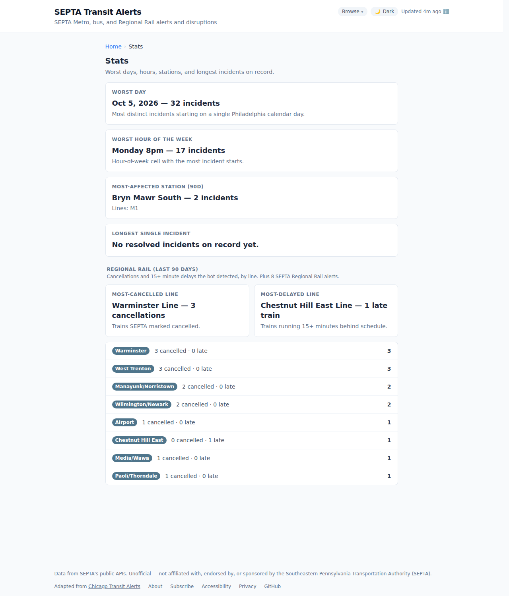
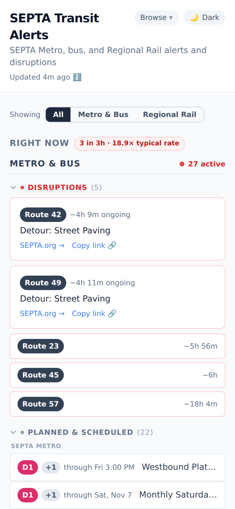

# SEPTA Transit Alerts

A public archive of SEPTA (Southeastern Pennsylvania Transportation Authority) service alerts and detected disruptions across SEPTA Metro, buses, and Regional Rail, with heatmaps, per-line history, and stats for Philadelphia-area riders.

> **Unofficial project.** Not affiliated with, endorsed by, or sponsored by SEPTA.

Adapted from [Chicago Transit Alerts](https://github.com/cailinpitt/chicago-transit-alerts), which does the same for the CTA and Metra. The site, views, and data shape carry over; the data pipeline is new and SEPTA-specific (see [How it works](#how-it-works)).

<p align="center">
  
</p>

## What's tracked

A collector polls SEPTA's public APIs every few minutes (every 2 on the [bot server](#bluesky-bots), every 10 on the GitHub Actions fallback):

- **Official SEPTA alerts** ([`/api/v2/alerts`](https://www3.septa.org/api/v2/alerts/)) — service advisories, real-time alerts, and short-term (≤72h) bus detours for SEPTA Metro, buses, and Regional Rail. Each alert is an incident from when SEPTA posted it until it leaves the feed or its stated end passes; edits to the text are kept as versions. Long-running construction detours and station-amenity notices (parking, ticket offices, waiting rooms) are left out. Affected stations are matched from the alert text against SEPTA's GTFS station list.
- **Regional Rail delays** ([TrainView](https://www3.septa.org/api/TrainView/index.php)) — any train running 15+ minutes late becomes an incident, updated as its lateness changes and resolved when it recovers or arrives. Each is anchored to the train's scheduled departure from [RRSchedules](https://www3.septa.org/api/RRSchedules/index.php?req1=9233).
- **Regional Rail cancellations** — trains TrainView marks cancelled, shown as "upcoming" until their scheduled departure.
- **Bus and Metro trip cancellations** ([GTFS-realtime trip updates](https://www3.septa.org/gtfsrt/septa-pa-us/Trip/rtTripUpdates.pb)) — SEPTA marks cancelled trips in its real-time feed, often hours ahead. They're grouped into one incident per route per service day ("14 Route 16 trips cancelled — 4:41 AM, 5:08 AM, …"), with each trip's scheduled time and terminals from SEPTA's GTFS schedule. The incident stays active until the last cancelled trip's scheduled end; trips that leave the feed before they were due are treated as reinstated.
- **Detected disruptions** ([TransitView](https://www3.septa.org/api/TransitViewAll/index.php) vehicle positions against the GTFS schedule), for buses, trolleys, and the M1:
  - **Gap** — two consecutive vehicles of one route pattern at least 20 minutes and twice the scheduled spacing apart. Spacing is each vehicle's scheduled start plus how late it's running; cancelled trips in between count toward the gap, and spacing across a trip that isn't on the tracker isn't guessed at.
  - **Bunching** — mid-route vehicles scheduled at least 8 minutes apart running within 250 m of each other.
  - **Missing vehicles** — at most half of a route's in-progress trips on the tracker (and at least three missing), on a route that's usually well tracked.
  - **Held in place** — two or more vehicles on a route stopped mid-route, within 600 m of each other, for 10+ minutes.
  - **Silent route** — a low-frequency route (too few trips in progress for the missing-vehicles check) with nothing on the tracker for long enough to have missed two scheduled trips (at least an hour), on a route that's usually well tracked. Only time during scheduled service counts.

  A condition must persist for at least 6 minutes, across at least two ticks, to open a detection, and be absent for as long to resolve it. If SEPTA has an active, unplanned alert on the same route, the detection attaches to that incident; otherwise it's a bot-only incident. When the tracker covers under half of a busy system's trips (a feed problem), detections are held as they are. Thresholds live in `DETECTOR_CONFIG` in [`collector/lib/vehicleDetectors.js`](collector/lib/vehicleDetectors.js).
- **Elevator outages** ([elevator API](https://www3.septa.org/api/elevator/index.php)) at SEPTA Metro and Regional Rail stations, archived separately on the accessibility page.

SEPTA Metro uses the 2025 line names: L1 (Market-Frankford), B1/B2/B3 (Broad Street Line, Express, Broad-Ridge Spur), M1 (Norristown High Speed Line), T1–T5 (subway-surface trolleys), G1 (Girard), and D1/D2 (Media and Sharon Hill). Search also understands the old names ("MFL", "BSL", "Route 101").

**Limits.** The subway lines (L1, B1–B3) appear in TransitView only as schedule-based placeholders without positions, so position-based detection can't cover them; their cancellations and SEPTA's alerts still do. "Missing vehicles" means missing from SEPTA's tracker, which can't tell a broken locator from a bus that never ran — hence the comparison with each route's usual tracking.

**Disrupted time** (line pages, system health, compare, homepage) counts unplanned disruptions only: SEPTA maintenance and construction advisories, advance-notice closures, and other planned work are listed but not counted. A route's cancelled trips for the day aren't counted as one long disruption either; the gaps and missing vehicles they cause are.

## What you see

- **Active alerts** — everything currently affecting service, split into a Metro & Bus column and a Regional Rail column, each grouped into disruptions, delays, and planned work.
- **Network filter** — All / Metro & Bus / Regional Rail. Metro line and bus route filters narrow Metro & Bus; Regional Rail has its own line filter.
- **90-day timeline, hour-of-week heatmap, and calendar** — when and where incidents cluster.
- **Line, route, and station pages** — `/line/l1`, `/route/17`, `/rail/line/pao`, `/station/8th-market`, `/rail/station/suburban-station`: reliability stats, resolution-time histograms, a station heatmap on a geographic line map, accessibility outages, and the full incident history.
- **Event pages** — every incident has a permalink at `/event/:id` with its timeline of SEPTA updates and detections, affected stations and map, and surrounding context on the same line and across the system.
- **Compare, stats, week recaps, and system health** — `/compare?metro=l1,b1`, `/stats`, `/week`, `/system/metro`, `/system/buses`, `/system/rail`.
- **Accessibility** — `/accessibility` lists current elevator outages and recent history.

Filter state, the pinned day, and the search query round-trip through the URL, so any view is a shareable link.

<table align="center">
  <tr>
    <td width="50%"><br><sub>Metro line · <code>/line/l1</code></sub></td>
    <td width="50%"><br><sub>Regional Rail line · <code>/rail/line/pao</code></sub></td>
  </tr>
  <tr>
    <td width="50%"><br><sub>Event · <code>/event/alert-136615</code></sub></td>
    <td width="50%"><br><sub>Accessibility · <code>/accessibility</code></sub></td>
  </tr>
  <tr>
    <td width="50%"><br><sub>System health · <code>/system/rail</code></sub></td>
    <td width="50%"><br><sub>Compare · <code>/compare?metro=l1,b1,t1</code></sub></td>
  </tr>
  <tr>
    <td width="50%"><br><sub>Calendar · <code>/calendar</code></sub></td>
    <td width="50%"><br><sub>Stats · <code>/stats</code></sub></td>
  </tr>
</table>

<p align="center">
  
</p>

## Routes

Client-side routing only — every path renders the SPA from the same `index.html`, and GitHub Pages's `404.html` (a copy of it) handles deep links. Lines, routes, stations, events, and the singleton pages are also prerendered as small HTML stubs so link previews show page-specific cards.

| Path | What it shows |
| --- | --- |
| `/` | Homepage: active alerts, filters, summary, timeline, and incident history. |
| `/event/:id` | One incident (`alert-136615`, `detour-d17327`, `delay-2026-10-05-3556`, `cancel-2026-10-05-3285`). |
| `/line/:line` | SEPTA Metro line — `l1`, `b1`, `b2`, `b3`, `m1`, `t1`–`t5`, `g1`, `d1`, `d2`. |
| `/route/:routeId` | Bus route — `/route/17`, `/route/K`, `/route/L1-OWL`. |
| `/rail/line/:line` | Regional Rail line by SEPTA route code — `/rail/line/pao`, `/rail/line/wtr`. |
| `/station/:slug`, `/rail/station/:slug` | Metro and Regional Rail station pages. |
| `/stations`, `/routes` | A–Z directories. |
| `/system/:mode` | `/system/metro`, `/system/buses`, `/system/rail`. |
| `/calendar`, `/stats`, `/compare`, `/accessibility` | 12-month heatmap, leaderboards, side-by-side comparison, elevator outages. |
| `/week`, `/week/:date` | Sunday–Saturday recaps. |
| `/day/:date` | Everything on one Philadelphia calendar day. |

## Bluesky bots

The [bot server](bot/README.md) posts what the collector sees to four Bluesky accounts. Each incident on the site links to its post, and each post links back:

| Account | Posts | Status |
|---|---|---|
| `alerts` | SEPTA's significant alerts, with a map of the affected stretch, and a threaded ✅ reply when SEPTA clears them | Live |
| `metro` | SEPTA Metro gaps, bunching, stuck trolleys and trains, silent routes, and an hourly roundup of missing vehicles, with maps; a 10-minute timelapse reply under gaps and bunches; system timelapses five times a day | Live |
| `bus` | The same for buses, plus clusters of several routes' buses stopped together | Live |
| `rail` | Regional Rail delays, cancellations and recaps | Planned |

Set the `BLUESKY_HANDLES` repository variable (e.g. `alerts=alerts.example.org,metro=metro.example.org,bus=bus.example.org,rail=rail.example.org`) to list the accounts in the site's About, Subscribe, and Browse menus. The bots are a port of [cta-insights](https://github.com/cailinpitt/cta-insights), the bots behind Chicago Transit Alerts.

## How it works

```
                      ┌─ bot server (bot/, every 2 min) ─┐
SEPTA APIs ──► collector/collect.js ──► `data` branch ──► deploy.yml ──► GitHub Pages
                      └─ collect.yml (fallback, 10 min) ─┘   one snapshot   npm run build   site + /data/*
```

1. **Collect.** The [bot server](bot/README.md) runs [`collector/collect.js`](collector/collect.js) every 2 minutes, posts to Bluesky, and publishes the result. Without a server, or whenever the server's last snapshot is over 20 minutes old, [`.github/workflows/collect.yml`](.github/workflows/collect.yml) runs it on a 10-minute schedule instead. Each run loads the archive from the `data` branch, applies the latest alerts, TrainView, elevator, TransitView, and trip-update feeds, and rewrites the published files: `alerts-recent.json`, monthly `alerts/<YYYY-MM>.json` shards, `incidents/by-line/<key>.json`, `alerts-index.json`, `aggregates.json`, `daily-counts.json`, and `accessibility.json`. The `data` branch is force-pushed as a single commit each run, so it never accumulates history; the monthly shards are the archive. It also holds `_collector-state.json`, the detectors' memory between ticks (last vehicle positions, pending and active detections, each route's usual tracking), which isn't deployed with the site. SEPTA's GTFS schedule is distilled into a ~2 MB index once a day and kept in the Actions cache (`--cache-dir`).
2. **Deploy.** When the collector sees a rider-visible change (an incident opening, resolving, or getting new text, or an elevator going out or coming back), it dispatches [`deploy.yml`](.github/workflows/deploy.yml). A 30-minute schedule catches everything else. The build copies the `data` branch into `public/data/` ([`scripts/fetch-data.js`](scripts/fetch-data.js)), builds the Vite app, and runs the postbuild steps: per-page and per-event share cards (Playwright), Atom/JSON feeds, the sitemap, and the CSV.
3. **Serve.** The site reads its data same-origin from `/data/` and re-polls `alerts-recent.json` every 5 minutes while open.

The collector has no dependencies beyond Node 24, and is a plain script: you can run it from cron on any machine instead (`node collector/collect.js --data-dir <dir> --cache-dir <dir>`), as long as the build can see the data directory. Anywhere from every 2 to every 10 minutes works: the detectors' confirmation windows are in minutes, not ticks.

Static reference data — Metro and Regional Rail stations, line shapes, and the bus route list — is generated from [SEPTA's GTFS bundle](https://www3.septa.org/developer/gtfs_public.zip) by [`scripts/build-reference-data.js`](scripts/build-reference-data.js) into `src/lib/*.json`.

## Setting up your own deployment

1. **Enable GitHub Pages** with *Settings → Pages → Source: GitHub Actions*.
2. **Set the site's address.** Add a repository variable `SITE_URL` (*Settings → Secrets and variables → Actions → Variables*) with the public origin, e.g. `https://septa.example.org` or `https://<user>.github.io` for a user site. It's used for canonical links, feeds, the sitemap, and share cards. Until it's set, those point at the placeholder `https://septa-transit-alerts.example`. For a custom domain, also set it under *Settings → Pages → Custom domain*. The site assumes it's served from the root of its domain, so a project page under `https://<user>.github.io/<repo>/` needs a custom domain.
3. **Start collecting.** Run *Actions → Collect SEPTA data → Run workflow* once. It creates the `data` branch and dispatches the first deploy; the schedule takes over from there.
4. **Optional: run the bot server** to post to Bluesky and collect every 2 minutes. See [bot/README.md](bot/README.md).
5. **Optional:** set `DATA_BASE_URL` to serve the data from another origin, e.g. `https://raw.githubusercontent.com/<owner>/<repo>/data` for a public repository, so the live site picks up every collector run without waiting for a deploy.

Scheduled Actions on a private repository count against your Actions minutes; at a 10-minute cadence the collector alone uses a few thousand minutes a month. Public repositories don't pay for standard runners. GitHub can also delay scheduled runs at busy times; the collector catches up on the next tick.

## Data as an API

The same files the site reads are published under `/data/` with no auth:

```
/data/alerts-recent.json            # active + last 93 days
/data/alerts-index.json             # manifest: months, lines, id → month
/data/alerts/<YYYY-MM>.json         # incidents first seen that Philadelphia month
/data/incidents/by-line/<key>.json  # all-time history for one line or route
/data/aggregates.json               # year-over-year counts
/data/daily-counts.json             # per-day counts behind the calendar
/data/accessibility.json            # elevator outages
/data/alerts.csv                    # flat CSV, one row per alert or detection
```

Every incident-bearing file shares one `incidents[]` shape (`schema_version: 2`): an `agency` of `septa`, a `mode` of `metro`, `bus`, or `regional_rail`, `routes`, a `lifecycle`, the SEPTA alert in `official_alert` (with SEPTA's own `type`/`cause`/`effect`/`severity` under `official_alert.septa` and a `source_url` to the route's SEPTA.org page), collector detections in `detections[]`, and a Regional Rail delay/cancellation `status`. When the bots have posted about an incident, `official_alert.post_url` (and `resolved_reply_url` for the ✅ reply) links to the Bluesky post. The full schema, with examples, is in [`public/llms-full.txt`](public/llms-full.txt); format changes are recorded in the [data changelog](public/data/CHANGELOG.md).

Feeds: `/feed.xml` and `/feed.json` for everything, plus one per Metro line (`/feed/line/l1.xml`), bus route (`/feed/route/17.xml`), and Regional Rail line (`/feed/rail/line/pao.xml`), each with a JSON Feed twin.

Please be a courteous client: cache responses, don't poll faster than every few minutes, and credit the project if you build something public.

## Development

```sh
npm install
npm run collect  # poll SEPTA's APIs once into public/data/ (repeat to build up history)
npm run dev      # local dev server, reading public/data/
npm test         # Vitest suite (site + collector)
npm run lint     # Biome check (lint + format)
npm run format   # Biome check --write (autofix)
npm run build    # production build into dist/ (needs Playwright's Chromium for share cards)
```

Other entry points:

- `node collector/collect.js --data-dir <dir> --fixtures collector/test/fixtures --now 1791244200000` builds a deterministic data directory from captured SEPTA responses (CI builds the site against this).
- `DATA_DIR=<dir> npm run build` builds against a specific data directory, e.g. a checkout of the `data` branch.
- `npm run reference-data` downloads SEPTA's GTFS bundle and regenerates the station, shape, and route JSON. To use a local copy of the bundle: `node scripts/build-reference-data.js path/to/gtfs_public.zip && npx biome format --write src/lib`.
- `npm run brand-assets` re-renders the PNG icons and the homepage share card (`public/og-image.png`) from their SVG/HTML sources.
- `CHROMIUM_PATH=/path/to/chromium` makes the Playwright steps use an existing Chromium instead of Playwright's download.
- [`debugging/`](debugging/DEBUGGING.md) has helpers for inspecting one event and rendering its share card.

CI ([`.github/workflows/ci.yml`](.github/workflows/ci.yml)) runs the test, lint, and build jobs on every PR to `main`.

## Stack

[Vite](https://vitejs.dev/) + [React 19](https://react.dev/) + [Tailwind CSS](https://tailwindcss.com/), [Vitest](https://vitest.dev/) + [Testing Library](https://testing-library.com/), [Biome](https://biomejs.dev/), and [Playwright](https://playwright.dev/) for share-card rendering. Hosted on GitHub Pages, with data collection on GitHub Actions.
